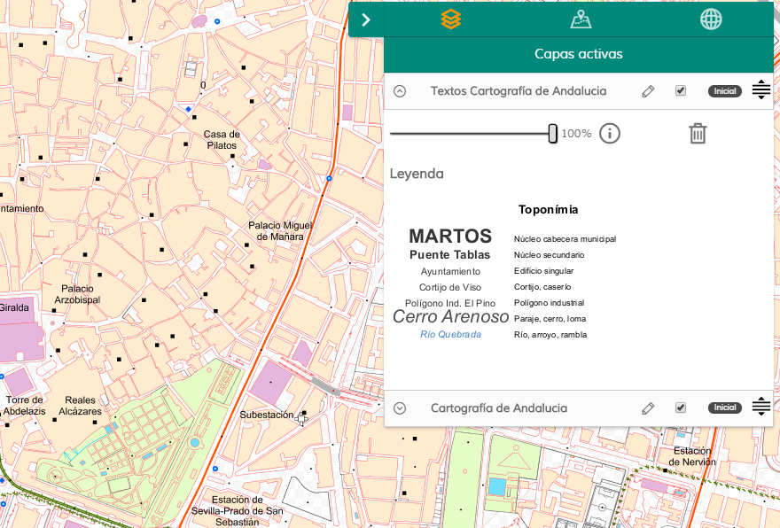
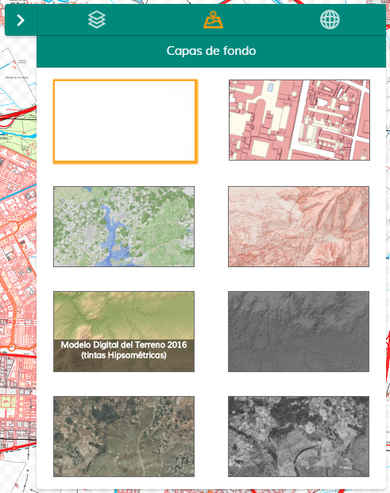
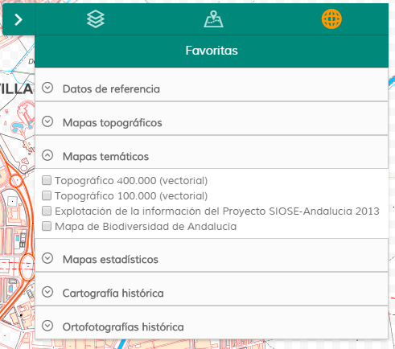

# Managelayers

[](https://github.com/sigcorporativo-ja/Mapea4-dev-webpack)  

## Descripción

 Plugin de [Mapea](https://github.com/sigcorporativo-ja/Mapea4) para la gestión de capas de forma avanzada, permitiendo su ordenación, eliminación, trasparencia, etc. También incluye una sección de mapas de fondo y otra de capas favoritas.
 
 

 Mediante configuración del plugin, o leyéndolo del WMC, pueden establecerse una serie de mapas base que se mostrarán de la siguiente manera.   

 

 También pueden predefinirse capas, así como su agrupación, que estáran disponibles para el usuario a través de la pestaña de "Favoritas"

       

 
## Recursos y uso

- js: managelayers.ol.min.js
- css: managelayers.min.css

```javascript
//objeto configurador del plugin
let paramsPlugin = {
        options: {
            panel: {
                className: 'clasePrivada',
                collapsedClass: 'g-cartografia-capas2',
                tooltip: 'Gestión de capas'
            }
        },
        config: {
            thematicLayers: { //capas favoritas
                params: {
                    groups: configGroups 
                },
                options: {
                    iconClass: 'g-cartografia-mundo2',
                    tooltip: 'Favoritas'
                }
            },
            baseLayers: { //capas de fondo
                params: {
                    baseMaps: [], //vacío lo lee del WMC
                    activatedBlankMap: false
                },
                options: {
                    tooltip: 'Capas de fondo'
                }
            }
        }
    };
    
let sp = new M.plugin.ManageLayers(paramsPlugin);
myMap.addPlugin(sp);
});
```  


